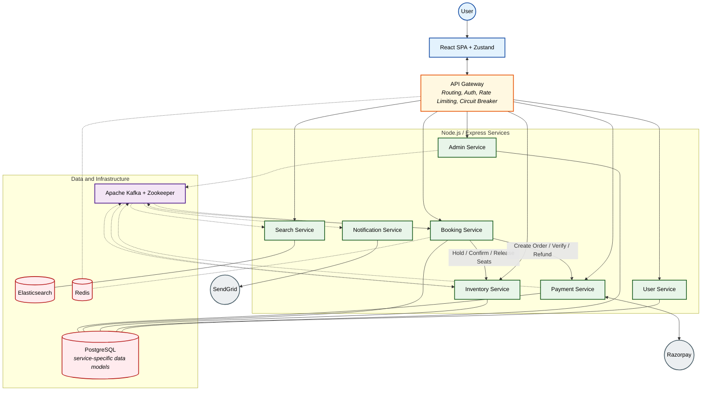

<p align="center">
  
  
  
  
  
  
  
  
</p>

# 🚆 BookMyTrain — Railway Reservation System

### Microservices-Based Booking Platform with Distributed Transaction and Seat-Coordination Workflows

> **Disclaimer:** This is an educational portfolio project inspired by railway reservation workflows. It is not affiliated with IRCTC or Indian Railways.

---

## 📖 Project Overview

**BookMyTrain** is a full-stack railway reservation project built to explore backend and distributed-systems concepts through a realistic ticket-booking workflow.

The application is divided into domain-focused Node.js and Express services for authentication, train administration, search, inventory, booking, payment, and notifications. An API Gateway provides a common entry point, while services communicate through HTTP for request-response operations and Apache Kafka for asynchronous events.

The booking flow includes idempotent request handling, temporary seat holds, Saga-based orchestration, compensating actions, payment processing, booking-state transitions, and segment-aware seat availability. Redis is used for caching, rate limiting, and temporary seat coordination; PostgreSQL and Prisma manage transactional data; Elasticsearch supports train search; and React provides the user interface.

This repository demonstrates the implementation of these patterns in a local development environment. It does not claim official IRCTC-level scale, production availability, or unverified latency and throughput figures.

---

## ✨ Core Features

- **Domain-Oriented Services:** Separate services for users, administration, search, inventory, bookings, payments, and notifications behind an API Gateway.
- **Saga-Based Booking Workflow:** Coordinates seat holding, payment-order creation, seat confirmation, and reverse-order compensation when a later step fails.
- **Idempotent Booking Requests:** Uses idempotency records to avoid creating duplicate bookings when the same request is retried.
- **Versioned Booking Transitions:** Uses Compare-And-Swap-style updates with version fields to detect stale booking-state changes.
- **Seat Coordination:** Combines temporary Redis locks with PostgreSQL row-level locking for inventory updates.
- **Segment-Aware Availability:** Tracks overlapping journey segments so the same physical seat can be reused for non-overlapping route portions.
- **Event-Driven Processing:** Uses Kafka events for payment outcomes, booking updates, inventory changes, schedule events, and notifications.
- **API Gateway Controls:** Includes JWT request authentication, downstream request timeouts, an in-process circuit breaker, and Redis Sorted Set-based sliding-window rate limiting.
- **Payment and Notifications:** Integrates Razorpay for payment workflows and SendGrid for booking-related email notifications.
- **Frontend Application:** Provides train search, seat selection, booking, payment, booking history, authentication, and administrative interfaces.

---

## 🧩 Services

| Component | Responsibility | Default Port |
|---|---|---:|
| API Gateway | Routing, authentication, rate limiting, circuit breaking | 3000 |
| User Service | Registration, login, and user management | 4001 |
| Admin Service | Trains, routes, stations, and schedules | 4002 |
| Search Service | Elasticsearch-backed train search | 4003 |
| Inventory Service | Seat availability, holds, confirmations, and segment tracking | 4004 |
| Booking Service | Booking lifecycle and Saga orchestration | 4005 |
| Payment Service | Razorpay orders, verification, webhooks, and refunds | 4006 |
| Notification Service | Booking-related email notifications | 4007 |
| Frontend | React web application | 5173 |

---

## 🏗️ System Architecture



> The diagram shows logical service ownership. For local development, Docker Compose provisions one PostgreSQL server together with Redis, Kafka, Zookeeper, Elasticsearch, and their administration tools.

---

## 🔄 Booking Workflow

1. The client submits a booking request with the selected journey segment, seats, passengers, and an idempotency key.
2. The Booking Service validates availability and attempts to acquire temporary Redis locks for the requested seats.
3. The Booking Service creates a pending booking and starts the Saga workflow.
4. The Inventory Service attempts to hold the seats using transactional inventory updates and row-level locking.
5. The Payment Service creates a Razorpay order.
6. A verified payment outcome is published through Kafka.
7. The Booking Service advances the booking state and asks the Inventory Service to confirm the seats.
8. A booking event is published for downstream notification processing.
9. When a step fails, completed Saga steps are compensated where applicable, such as releasing held seats or initiating a refund.

---

## 💻 Tech Stack

### Frontend

- React
- Vite
- React Router
- Zustand
- Tailwind CSS
- Axios

### Backend

- Node.js
- Express.js
- PostgreSQL
- Prisma ORM
- Redis
- Apache Kafka
- Elasticsearch
- JWT authentication
- Razorpay
- SendGrid

### Infrastructure and Tooling

- Docker
- Docker Compose
- Zookeeper
- Kafka UI
- pgAdmin
- Kibana

---

## 🚀 Getting Started

### Prerequisites

- Node.js and npm
- Docker and Docker Compose
- Razorpay test credentials for payment flows
- SendGrid credentials for email notifications

### 1. Clone the Repository

```bash
git clone https://github.com/Rudy-123/IRCTC.git
cd IRCTC
```

### 2. Start Infrastructure Dependencies

```bash
docker compose up -d
```

This command starts the local infrastructure only:

- PostgreSQL
- pgAdmin
- Redis Stack
- Zookeeper
- Kafka
- Kafka UI
- Elasticsearch
- Kibana

It does **not** start the Node.js services or the React frontend.

### 3. Configure Environment Variables

Create the required `.env` file inside each service directory. Configure database URLs, Redis, Kafka, service URLs, JWT secrets, Razorpay credentials, and SendGrid credentials as required by that service.

### 4. Install Dependencies

Run the following command inside the frontend, API Gateway, and each service directory:

```bash
npm install
```

### 5. Generate Prisma Clients and Apply Migrations

For every service containing a Prisma schema:

```bash
npx prisma generate
npx prisma migrate dev
```

Ensure that the required logical databases exist in the local PostgreSQL server before running migrations.

### 6. Start the Services

Start every service in a separate terminal from its own directory:

```bash
npm run dev
```

Then start the frontend:

```bash
cd frontend
npm run dev
```

### 7. Local Endpoints

- **Frontend:** `http://localhost:5173`
- **API Gateway:** `http://localhost:3000`
- **Kafka UI:** `http://localhost:8080`
- **pgAdmin:** `http://localhost:8081`
- **Redis Insight:** `http://localhost:8001`
- **Kibana:** `http://localhost:5601`

---

## 📌 Project Scope

This repository is intended to demonstrate system-design and backend-engineering concepts in a portfolio environment.

It should not be interpreted as:

- an official IRCTC application;
- a production deployment;
- proof of massive concurrent-booking capacity;
- proof of high availability or horizontal scalability;
- evidence of sub-second booking confirmation; or
- a benchmarked replacement for a real railway reservation platform.

Performance or scalability numbers should only be added after publishing reproducible benchmark scripts, hardware details, workloads, and measured results.

---

## 🤝 Contributing

1. Fork the repository.
2. Create a feature branch.
3. Add or update tests and documentation.
4. Commit the changes.
5. Open a pull request.
