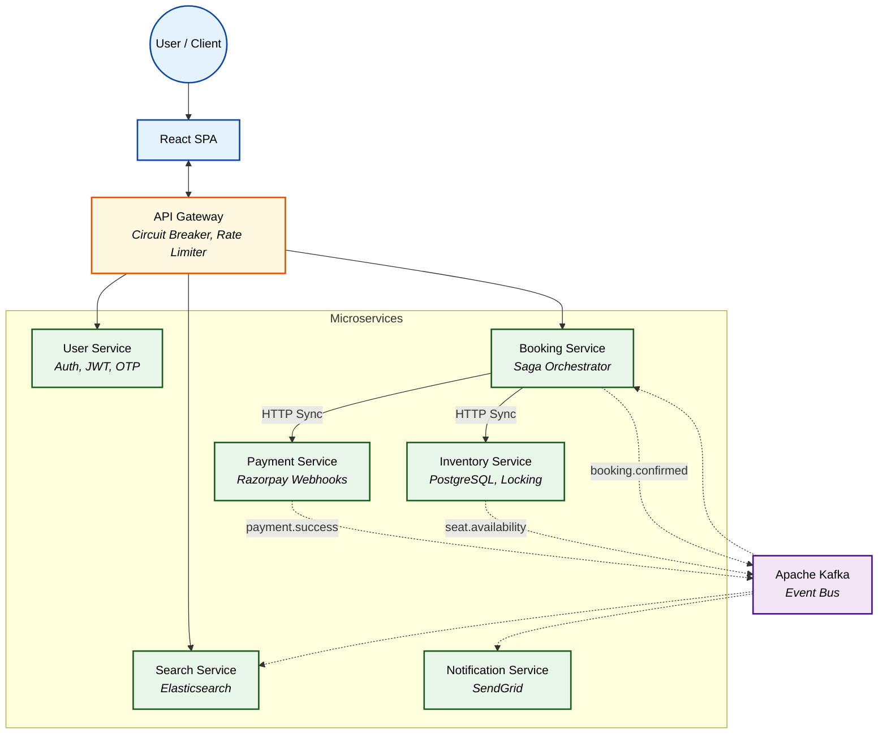

<p align="center">
  
  
  
  
  
  
  
  
</p>

# 🚆 IRCTC Railway Booking System

### Scalable, Fault-Tolerant Microservices Platform for High-Concurrency Ticket Booking

---

## 📖 Project Overview

**IRCTC Railway Booking System** is a robust, high-availability ticket reservation platform designed to provide low-latency operations and handle massive concurrent bookings. Built to handle scale reminiscent of India's official rail booking system, it features a decentralized microservices architecture for fault tolerance, seamless data synchronization, and horizontal scalability.

Instead of relying on a monolithic bottleneck, this platform utilizes **Saga Orchestration**, **distributed locking**, and an **event-driven Kafka backbone** to distribute workloads evenly. It empowers users to achieve sub-second booking confirmations, prevents race conditions during seat selection, and scales horizontally across completely isolated service boundaries.

Equipped with a highly optimized **Node.js/Express Backend Grid**, a **PostgreSQL Database per Service**, and an intuitive **React Web Interface**, it provides both performance and effective transaction management.

---

## ⚙️ Key Optimizations

- **Distributed Seat Locking via Redis Lua Scripts:** Developed a high-performance concurrency control mechanism using Redis Lua scripts. Acquires atomic, all-or-nothing locks across multiple requested seats sorted lexicographically to prevent deadlocks. Guarantees that two users cannot simultaneously reserve the same seat, with a fallback cleanup mechanism to instantly release locks if any single seat fails.
- **Saga Orchestration & Optimistic Concurrency:** Implemented the Saga Pattern in the Booking Coordinator Service to manage distributed transactions across the Inventory and Payment services. Updates to critical state use Compare-And-Swap (CAS) with version fields (`version = version + 1`), ensuring optimistic concurrency control without the overhead of heavy pessimistic DB locks.
- **Segment-Based Booking with Overlap Detection:** Built a complex inventory management system using PostgreSQL `FOR UPDATE NOWAIT` pessimistic locking. Uses `SeatSegmentLock` rows to track seat availability across specific route segments (e.g., A→C and C→E on an A→E route), seamlessly calculating overlaps (`newFrom < existing.to AND newTo > existing.from`) to maximize seat utilization.
- **Fault-Tolerant API Gateway with Circuit Breaking:** Engineered a custom Axios-based API Gateway Proxy wrapped in a 3-state Circuit Breaker (CLOSED → OPEN → HALF_OPEN). Instantly detects downstream service degradation (e.g., User Service timeout), aborts requests to prevent cascading failures, and implements sliding window rate limiting via Redis Sorted Sets (ZSET) to protect against DDoS attacks.
- **Two-Token Authentication & Device Fingerprinting:** Fortified security with an Access + Refresh Token rotation strategy using `httpOnly` cookies. Refresh tokens are paired with device fingerprinting and rotated silently on expiry, immediately neutralizing stolen tokens and preventing session hijacking.

---

## 🏗️ System Architecture

The application utilizes a distributed microservices architecture, seamlessly integrating a robust API Gateway with isolated backend domain services (User, Booking, Inventory, Payment, Search) communicating synchronously via HTTP and asynchronously via Apache Kafka.

### High-Level Architecture



---

## 🔄 Data Workflow

The lifecycle of a booking operation follows a strict, highly consistent path:

1. **Client Request**: A booking request is issued via the API Gateway, carrying seat and passenger details along with a unique `idempotencyKey`.
2. **Atomic Lock Acquisition**: The Booking Service orchestrator sorts the requested seats and attempts an all-or-nothing Redis lock using a custom Lua script.
3. **Saga Execution**:
   - **Step 1 (Inventory)**: Inventory service executes `FOR UPDATE NOWAIT` to deduct seat segments.
   - **Step 2 (Payment)**: Payment service creates a Razorpay order.
4. **Payment Processing**: The client completes the payment in the Razorpay UI. The Payment Service captures this via webhook (or client-side verification) and publishes a `payment.success` event to Kafka.
5. **Confirmation & Notification**: The Booking Service consumes the event, updates the booking status to `CONFIRMED` via CAS, finalizes the seats in Inventory, and publishes `booking.confirmed` to trigger email alerts via the Notification Service.

---

## 💻 Tech Stack

### Frontend
- **Framework:** React + Vite
- **State Management:** Zustand
- **Styling:** TailwindCSS

### Backend
- **Runtime:** Node.js, Express
- **Architecture:** Microservices, Saga Orchestrator, API Gateway
- **Database:** PostgreSQL (per-service isolation), Prisma ORM
- **Cache/Locking:** Redis (redis-stack)
- **Message Broker:** Apache Kafka, Zookeeper
- **Search Engine:** Elasticsearch 8, Kibana

### Infrastructure
- **Containerization:** Docker & Docker Compose
- **Payment Gateway:** Razorpay
- **Notifications:** SendGrid

---

## 📌 Getting Started

### 1. Clone Repository

```bash
git clone https://github.com/Rudy-123/IRCTC.git
cd IRCTC
```

### 2. Deployment (Docker Compose)

The easiest way to spin up the entire cluster (PostgreSQL, Redis, Kafka, Zookeeper, Elasticsearch) is using Docker Compose:

```bash
docker-compose up -d
```

### 3. Install Dependencies & Migrate

Install dependencies in the root and across all microservices. Then run Prisma migrations for each service:

```bash
# Example for User Service
cd User-Service
npm install
npx prisma migrate dev
```

### 4. Start Services

Start each microservice in its respective directory:

```bash
cd api-gateway && npm run dev
```

### 5. Access the Application

- **Frontend Dashboard:** `http://localhost:5173`
- **API Gateway:** `http://localhost:3000`

---

## 🤝 Contributing

Contributions are welcome.

1. Fork the repository
2. Create a feature branch (`git checkout -b feature/new-feature`)
3. Add tests and necessary documentation
4. Commit your changes (`git commit -m 'Add new feature'`)
5. Submit a pull request

---

## 📄 License

This project is licensed under the **MIT License**.
See `LICENSE` file for more details.
