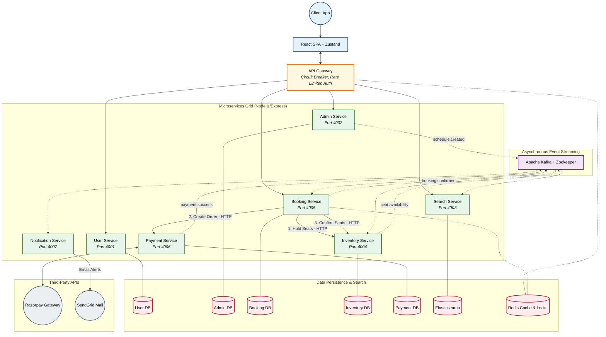

<p align="center">
  
  
  
  
  
  
  
  
</p>

# 🚆 IRCTC Railway Booking System

### Scalable, Fault-Tolerant Microservices Platform for High-Concurrency Ticket Booking

---

## 📖 Project Overview

**IRCTC Railway Booking System** is a robust, high-availability ticket reservation platform designed to provide low-latency operations and handle massive concurrent bookings. Built to handle scale reminiscent of India's official rail booking system, it features a decentralized microservices architecture for fault tolerance, seamless data synchronization, and horizontal scalability.

Instead of relying on a monolithic bottleneck, this platform utilizes **Saga Orchestration**, **distributed locking**, and an **event-driven Kafka backbone** to distribute workloads evenly. It empowers users to achieve sub-second booking confirmations, prevents race conditions during seat selection, and scales horizontally across completely isolated service boundaries.

Equipped with a highly optimized **Node.js/Express Backend Grid**, a **PostgreSQL Database per Service**, and an intuitive **React Web Interface**, it provides both performance and effective transaction management.

---

## ⚙️ Key Optimizations

- **Distributed Seat Locking (Redis):** Employs Redis Lua scripts for atomic, all-or-nothing lock acquisition across multiple requested seats (sorted lexicographically). Prevents race conditions and ensures two users cannot simultaneously reserve the same seat.
- **Saga Orchestration & Optimistic Concurrency:** Uses the Saga Pattern in the Booking Service to orchestrate distributed transactions. Leverages Compare-And-Swap (CAS) with version fields for optimistic concurrency control, avoiding heavy DB locks.
- **Segment-Based Booking & Overlap Detection:** Uses PostgreSQL `FOR UPDATE NOWAIT` pessimistic locking with `SeatSegmentLock` rows to track and maximize availability across specific route segments, calculating overlaps dynamically.
- **API Gateway Circuit Breaker & Rate Limiting:** Engineered an Axios-based API Gateway Proxy with a 3-state Circuit Breaker to prevent cascading failures. Defends against traffic spikes using a Sliding Window rate limiter backed by Redis Sorted Sets (ZSET).
- **Two-Token Authentication:** Secures user sessions using an Access + Refresh Token rotation strategy with `httpOnly` cookies and device fingerprinting. Tokens rotate silently on expiry, immediately neutralizing stolen credentials.

---

## 🏗️ System Architecture

The application utilizes a distributed microservices architecture, seamlessly integrating a robust API Gateway with isolated backend domain services communicating synchronously via HTTP and asynchronously via Apache Kafka. Each service owns its own database for true decoupled scalability.

### High-Level Architecture (Full System Topology)



---

## 🔄 Data Workflow

The lifecycle of a booking operation follows a strict, highly consistent path:

1. **Client Request**: A booking request is issued via the API Gateway, carrying seat and passenger details along with a unique `idempotencyKey`.
2. **Atomic Lock Acquisition**: The Booking Service orchestrator sorts the requested seats and attempts an all-or-nothing Redis lock using a custom Lua script.
3. **Saga Execution**:
   - **Step 1 (Inventory)**: Inventory service executes `FOR UPDATE NOWAIT` to deduct seat segments.
   - **Step 2 (Payment)**: Payment service creates a Razorpay order.
4. **Payment Processing**: The client completes the payment in the Razorpay UI. The Payment Service captures this via webhook (or client-side verification) and publishes a `payment.success` event to Kafka.
5. **Confirmation & Notification**: The Booking Service consumes the event, updates the booking status to `CONFIRMED` via CAS, finalizes the seats in Inventory, and publishes `booking.confirmed` to trigger email alerts via the Notification Service.

---

## 💻 Tech Stack

### Frontend

- **Framework:** React + Vite
- **State Management:** Zustand
- **Styling:** TailwindCSS

### Backend

- **Runtime:** Node.js, Express
- **Architecture:** Microservices, Saga Orchestrator, API Gateway
- **Database:** PostgreSQL (per-service isolation), Prisma ORM
- **Cache/Locking:** Redis (redis-stack)
- **Message Broker:** Apache Kafka, Zookeeper
- **Search Engine:** Elasticsearch 8, Kibana

### Infrastructure

- **Containerization:** Docker & Docker Compose
- **Payment Gateway:** Razorpay
- **Notifications:** SendGrid

---

## 📌 Getting Started

### 1. Clone Repository

```bash
git clone https://github.com/Rudy-123/IRCTC.git
cd IRCTC
```

### 2. Deployment (Docker Compose)

The easiest way to spin up the entire cluster (PostgreSQL, Redis, Kafka, Zookeeper, Elasticsearch) is using Docker Compose:

```bash
docker-compose up -d
```

### 3. Install Dependencies & Migrate

Install dependencies in the root and across all microservices. Then run Prisma migrations for each service:

```bash
# Example for User Service
cd User-Service
npm install
npx prisma migrate dev
```

### 4. Start Services

Start each microservice in its respective directory:

```bash
cd api-gateway && npm run dev
```

### 5. Access the Application

- **Frontend Dashboard:** `http://localhost:5173`
- **API Gateway:** `http://localhost:3000`

---

## 🤝 Contributing

Contributions are welcome.

1. Fork the repository
2. Create a feature branch (`git checkout -b feature/new-feature`)
3. Add tests and necessary documentation
4. Commit your changes (`git commit -m 'Add new feature'`)
5. Submit a pull request

---

## 📄 License

This project is licensed under the **MIT License**.
See `LICENSE` file for more details.


